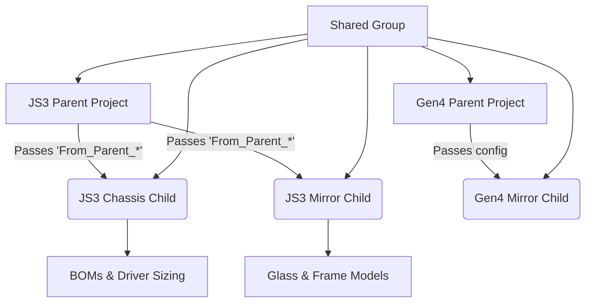

# DriveWorks Architecture Manifest

This manifest outlines the current and proposed state of the DriveWorks ecosystem.

## 1. Project Index & Analysis

| Project Name | Core Purpose | Input Requirements | Primary Outputs |
|---|---|---|---|
| **JS3 (Parent)** | Master configurator for the JS3 ecosystem. Parses Customer Part Numbers (CPNs) to resolve the mirror type and options. | User CPN string, Options (Lighting, Voltage) | `JS3_Assembly` model, `LegacyConfigured` document, triggers for child projects |
| **JS3 Chassis** | Handles the structural and electrical configuration of the chassis. Computes LED wattage, segment lengths, and driver sizing. | `From_Parent_*` variables (MirrorType, Width, Height, Lighting, Voltage) | `JS3_CHASSIS_BOM` document, Chassis SolidWorks models |
| **JS3 Mirror** | Configures the front-facing glass and frame elements. | `From_Parent_*` variables (MirrorType, Width, Height, Frost options) | Glass models, `INT3_M_BOM_Generic`, `FUS3_M_BOM_Generic` |
| **Gen4** | Next-generation master configurator logic. | Gen4 CPN and component specs | `ExportToGen4ModelsTable`, `ExportToGen4Table` |
| **Gen4 Mirror** | Gen4 mirror specific configurator. | Gen4 Parent inputs | `INT4_Mirror_BOM`, `ARI4_Mirror_BOM`, etc. |
| **RAD3** | Specific model logic template/base for RAD3/RAD4. | Specifications | `RAD3_M_BOM`, `RAD4_M_BOM`, `JS Configured` |
| **Radiance** | Radiance specific standalone configuration. | Form Controls | `BOM`, `Rad_3D_File` |
| **Spark** | Spark model configurator. | Form Controls | `Spark Configured`, `Models` |

## 2. Interaction Map



## 3. Logic Extraction (Top 5 Complex Projects)

1. **JS3 Parent**: Uses nested `Find()` and `If()` functions on `CPNInputReturn` to set `MirrorType2`. Values are passed down using `From_Parent_` constant mapping.
2. **JS3 Chassis**: Calculates `LEDSegmentLength` (50mm vs 55.5mm). Computes total segments and applies caps based on Driver Types (e.g., Ava=99, LSE=89, HO=109, RAD4=74). Uses `Ceiling()` to determine required `DriverQty`.
3. **JS3 Mirror**: Handles complex dimensional math for Frost and TV cutouts. Defines limits with constraint variables (e.g., `_Error_Constraint_Bevel`).
4. **Gen4 Parent**: Generates configuration strings (`_Config_*`) for dynamic SolidWorks model swapping. 
5. **RAD3**: Acts as a hybrid base, generating documents for multiple RAD models (`RAD3_M_BOM`, `RAD4_M_BOM`).

## 4. Proposed Folder Structure

```
N:\Driveworks
├── Group_Data/                  (Shared .drivegroup, ODBC, Macros)
├── Products_JS3/                (JS3 Ecosystem)
│   ├── Parent/                  (JS3.driveprojx)
│   ├── Chassis/                 (JS3 Chassis.driveprojx)
│   ├── Mirror/                  (JS3 Mirror.driveprojx)
│   └── Testing/
├── Products_Gen4/               (Gen4 Ecosystem)
│   ├── Parent/
│   ├── Mirror/
├── Products_Standalone/         (Self-contained models)
│   ├── Radiance/
│   ├── Round-Mirrors/
│   ├── Spark/
│   └── RAD3/
├── Reference/                   (Excel Logic, Specifications, Scripts)
└── Legacy_Archive/              (Old tests, Carlos Test, JS, TestProject95)
```
