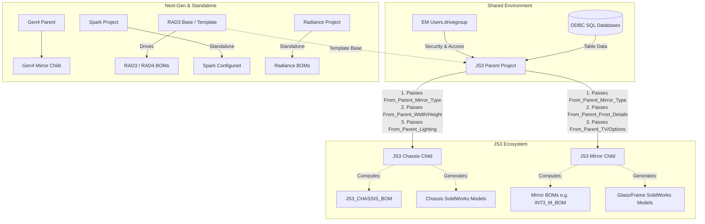

# DriveWorks Ecosystem - v2.0 Architectural Audit

## 1. Visual Interaction Map

The following map illustrates the hierarchical "spiderweb" of the current DriveWorks configuration, focusing heavily on the JS3 Ecosystem and its explicit data handshakes.

---

## 2. Logic & Rule Audit

Based on the analysis of the `.driveprojx` files and the unpacked variable documentation, here are the core logic triggers for the top 5 most complex projects:

### A. JS3 Parent
*   **Core Trigger**: The `CPNInputReturn` (Customer Part Number).
*   **Logic Routing**: The Parent uses nested `Find()` and `If()` statements to parse the CPN prefix (e.g., `"RAD4-"`, `"FUS3-"`, `"INT3-"`) to set the master `MirrorType2` variable.
*   **The Handshake**: Once resolved, the Parent pushes these properties down to the children via DriveWorks Child Controls. The receiving end variables must always match the `From_Parent_[Variable_Name]` nomenclature.

### B. JS3 Chassis (Child)
*   **Core Trigger**: `From_Parent_Lighting` and `From_Parent_Mirror_Type`.
*   **Segment Calculation Engine**: Uses conditional limits to enforce segment caps based on driver types. For example, Ava dimming is capped at 99 segments, whereas RAD4 models are hard-capped at 74.
*   **Wattage Calculation**: Takes the `PowerRequirement` and multiplies by a standard constant buffer (15% safety margin: `DriverBuffer = 0.15`). It then calculates `DriverQty` by using a `Ceiling()` function against the single-driver maximums.

### C. JS3 Mirror (Child)
*   **Core Trigger**: Cutout and dimensional constants (`From_Parent_Width`/`Height`).
*   **Feature Constraint Engine**: Enforces manufacturing capabilities. Uses absolute constraints such as `_Error_Absolute_Max_Glass_Dim` (max 106") or `_Error_Constraint_Bevel` (cut size <= 60x72 or 30 SQF).
*   **Positional Math**: Calculates exact offsets for TVs, clocks, and frosty edges to ensure features don't float off the mirror or crash into the support posts.

### D. Gen4 Project (Parent)
*   **Core Trigger**: Next-generation configuration input (likely modularized CPNs).
*   **Output Routing**: Highly dependent on SQL outputs and generation table updates (e.g., `ExportToGen4ModelsTable`). Focuses on streamlined model swapping over the heavy string-parsing legacy of JS3.

### E. RAD3 (Template/Standalone)
*   **Core Trigger**: Form controls capturing Radiance specifications.
*   **Templating Logic**: Used historically as a template codebase for the JS3 architectural branching. Generates both RAD3 and RAD4 BOMs based on isolated rules that were later adopted by the JS3 Master.

### Shared Group Macros & Variables
*   **DriveGroups**: The `EM Users.drivegroup` acts as the security and global macro host.
*   **Global Variables**: Configurations prefixed with `_Config_` (SolidWorks variant strings) and `_Driver_` (e.g., `_Driver_Watt_D1 = 91.4`) are globally standardized constants relied upon by all children.

---

## 3. Future-State Critique (v2.0 Preparation)

### Technical Debt
1.  **Massive `If()` String Parsing**: Parsing CPNs via nested `If(IfError(Find(...)))` in JS3 Parent is brittle. In v2.0, this should be replaced with a structured DriveWorks Table Lookup (e.g., `VLookup()` against a master CPN rule table).
2.  **Hardcoded Caps**: Values like `74` segments for RAD4 or `99` for Ava are hardcoded into massive logic strings. These should be decoupled into a centralized `Driver_Limitations` Data Table.
3.  **Error Handling Bloat**: The projects contain dozens of explicit text variables (`_Error_...`) which act as validation flags. These could be streamlined into a unified Macro-driven validation summary.

### Scalability Gaps
1.  **Constant Mapping Overhead**: The `From_Parent_` mapping technique requires 1:1 manual linking for every new variable introduced. If a v2.0 mirror requires 50 new specs, that's 50 mappings per child. 
2.  **Chassis Logic Duplication**: Lighting calculations are deeply embedded in the Chassis project. If a new lighting type is invented, multiple deep formulas (Segment Length, Wattage, Driver Limits) must be manually tracked down and updated.

### External Dependencies
1.  **ODBC/SQL Writes**: Projects like Gen4 heavily utilize Document generation to write to SQL (e.g., `ExportToGen4ModelsTable`). If database schemas change, the DriveWorks document mappings will silently fail.
2.  **External File Paths**: Variables prefixed with `File_Location_` must be centralized. If a server moves, the configuration breaks. 
3.  **Group Connectivity**: Dependencies on `EM Users.drivegroup` mean the projects cannot easily be tested offline or in a sandbox without duplicating the group database.

---

## 4. The "Live" Logic Trace

Here is exactly what happens when an order hits the system:

1.  **Data Ingestion**: A user (or integrated system) inputs an order string, primarily the Customer Part Number (CPN) and basic Dimensions (Width x Height).
2.  **Parent Interpretation (JS3 Parent)**: The Parent project reads the CPN string. It extracts the model prefix (e.g., "RAD4") to set the `MirrorType`, determines the `Lighting` type, and flags special options (Defogger, TV, Clock). It checks these against its internal Error/Constraint rules to ensure it's buildable.
3.  **The Handshake**: The Parent acts as a dispatcher, pushing the parsed, clean data downwards into the `From_Parent_` constants of the JS3 Chassis and JS3 Mirror child projects.
4.  **Chassis Engineering (JS3 Chassis)**: The Chassis project receives the dimensions and lighting type. It calculates exactly how long the LED strips need to be (rounding to whole cuttable segments: e.g., 50mm or 55.5mm). It sums the power draw, adds a 15% safety buffer, and figures out how many power drivers are needed to support the load without catching fire.
5.  **Glass Engineering (JS3 Mirror)**: The Mirror project takes the same dimensions but focuses on aesthetics. It determines the frosted border width, calculates where the bevels go, and does the 2D positional math to ensure the TV screen or Clock cutout is perfectly centered without hitting the backframe.
6.  **Final Generation**: Both child projects trigger SolidWorks. The `_Config_` strings tell SolidWorks exactly which model variants to load and suppress. Final part geometries are exported, and DriveWorks generates the finalized BOM text/Excel documents (e.g., `JS3_CHASSIS_BOM` and `RAD4_M_BOM`).
