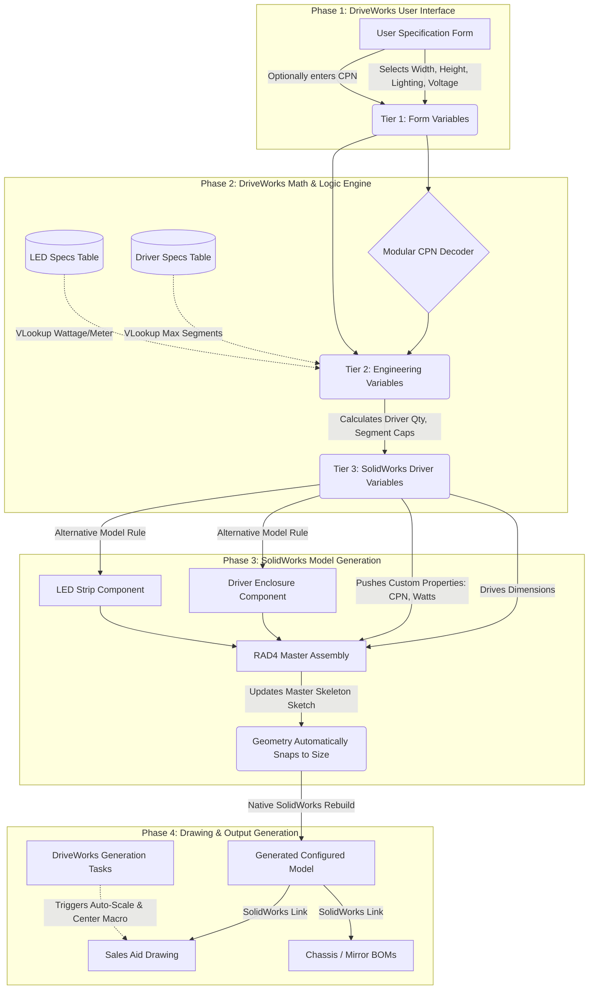

# RAD4 Independent Configurator Plan

This document outlines the architecture for a streamlined, standalone RAD4 DriveWorks configurator. It visualizes the flow from user input to final drawing generation, emphasizing a modular, table-driven approach that eliminates legacy technical debt.

## 1. Visual Interaction Map

The following flowchart illustrates the complete data lifecycle for the proposed v2.0 standalone RAD4 configurator.

---

## 2. Implementation Roadmap

### Step 1: Establish Data Tables
Before writing a single rule, build the fundamental datasets in DriveWorks Administrator.
*   **Driver_Specs Table**: Columns for `Name`, `Max_Wattage`, `Segment_Cap`, `Physical_Width`, and `Physical_Length`.
*   **LED_Specs Table**: Columns for `Lighting_Type`, `Segment_Length_mm`, and `Watts_per_Meter`.

### Step 2: The Three-Tier Variable Structure
Create clear folders/categories for variables to keep the logic clean.
*   **[1] Inputs**: Variables matching the Form Controls exactly.
*   **[2] Engineering**: Calculate `Total_Wattage` using `= (Width + Height) * 2 * VLookup(Lighting_Type, LED_Specs)`. Calculate `Driver_Qty` by dividing total wattage by the `Max_Wattage` pulled from the `Driver_Specs` table.
*   **[3] SW_Outputs**: Concatenate the exact strings required by the SolidWorks file names and custom properties.

### Step 3: Redesign the Master SolidWorks Assembly
Do not use DriveWorks to explicitly calculate X, Y offsets for every component.
*   Create a "Skeleton Part" (a part containing only sketches) inside the main assembly.
*   Drive the overall Width and Height dimensions of the skeleton sketch from DriveWorks.
*   Use SolidWorks native constraints (Symmetric, Midpoint, Equations) to calculate the `Frost_Inset` and LED track locations natively. 
*   Mate the LED strips and Driver enclosures directly to this skeleton sketch. When DriveWorks changes the main width, the skeleton expands, and all parts snap into place perfectly.

### Step 4: Streamlined Property Mapping
*   Use DriveWorks **Model Rules** to push the calculated `Wattage`, `CPN`, and `Voltage` directly into the Custom Properties of the new RAD4 Assembly (`$PRP:"Wattage"`).

### Step 5: Native Drawing Automation
*   Open your Master Sales Aid Drawing template in SolidWorks.
*   Edit the text blocks and link them directly to the Assembly's Custom Properties (e.g., `SW-File Name` or `$PRPSHEET:"Wattage"`).
*   Add a standard **DriveWorks Generation Task** to the Drawing rules to execute `Rescale and Center Views`. This guarantees that regardless of whether the mirror is 24x36 or 60x80, the views will fit cleanly on the PDF without requiring explicit Macro code.
