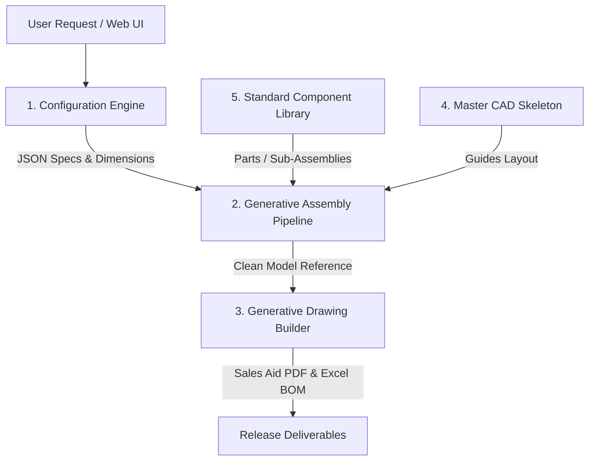
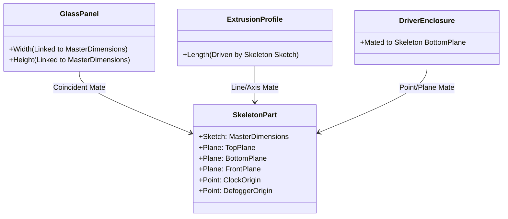

# SolidWorks Configurator Transition Architecture: Copy-and-Modify to Build-from-Scratch

This document outlines the system architecture, transition stages, and implementation guidelines to migrate the **RAD4 SolidWorks Configurator** from the current **Template-Based Copy-and-Modify** approach to a **Skeleton-Driven Generative From-Scratch** modeling paradigm.

---

## 1. Executive Summary & Paradigm Shift

The current configurator selects the closest standard mirror assembly (e.g., `36.00x36.00`), copies it, scales custom-sized extrusion panels, and suppresses or activates optional components (clocks, defoggers, drivers). While functional, this approach suffers from:
* **High Maintenance**: Maintaining hundreds of CAD templates in the engineering vault.
* **Fragility**: High risk of mates breaking when custom sizes deviate significantly from template defaults.
* **Option Suppression Overhead**: Processing time wasted suppressing and deleting unused parts in templates.

The proposed **Generative From-Scratch** approach constructs a clean assembly dynamically. To prevent the mathematical and programmatic complexity of writing geometric vertex mates in raw COM code (which is notoriously fragile in SolidWorks), the architecture uses a **Skeleton-Driven Assembly Design Pattern**.

```
+---------------------------------------------------------------------------------------------------+
|                                          PARADIGM SHIFT                                           |
+------------------------------------+--------------------------------------------------------------+
| Current: Copy-and-Modify           | Proposed: Generative From-Scratch                            |
+------------------------------------+--------------------------------------------------------------+
| • Relies on pre-built vault files  | • Starts with empty assembly container                       |
| • Scaled via reference swapping    | • Size driven by a single Master Skeleton Sketch             |
| • Unused parts suppressed/deleted  | • Accessory parts inserted programmatically ONLY when active  |
| • Mates are hardcoded in vault     | • Parts mate dynamically to Skeleton planes and points       |
+------------------------------------+--------------------------------------------------------------+
```

---

## 2. Core Architectural Components

The generative system consists of five decoupled layers:



### 1. Configuration Engine (`rad4_engine.py`)
Calculates mathematical parameters based on inputs (e.g., perimeter lengths, LED strip segments, driver wattage, part numbers) and returns a clean, structured JSON configuration data object.

### 2. Generative Assembly Pipeline (`sw_api.py`)
Creates a blank assembly, loads the Master CAD Skeleton, applies configured dimensions to the skeleton, inserts components from the library, and mates them directly to the skeleton.

### 3. Generative Drawing Builder
Generates front/back/section drawing sheets, programmatically inserts model views, automatically aligns dimensions, and injects notes based on option logic.

### 4. Master CAD Skeleton (`skeleton.sldprt`)
An empty SolidWorks part containing only 3D sketches, planes, and coordinate points representing the structural layout of the mirror (width, height, frost inset, clock cutout, driver location).

### 5. Standard Component Library (The Vault)
A simplified folder of option-independent CAD models (aluminum extrusion profiles, LED strips, corner brackets, clocks, driver boxes) that do not contain size or option logic.

---

## 3. The Skeleton-Driven Design Pattern

Rather than mating parts to each other (e.g., mating the diffuser to the extrusion, and the extrusion to the glass), which creates a chain of dependencies prone to failure, **all parts are mated directly to the Skeleton Part**.



### Benefits of Skeleton Mating:
1. **Decoupled Parts**: Parts can be swapped or modified without breaking neighboring mates.
2. **Centralized Scaling**: Changing the dimension of a sketch inside `skeleton.sldprt` automatically scales the entire assembly upon rebuild.
3. **No Vertex Guessing**: Mates are defined using permanent skeleton sketch lines/planes, which have fixed names (`WidthLine@SkeletonSketch`), preventing SolidWorks from losing entity IDs.

---

## 4. Key SolidWorks COM API Methods

To execute this programmatically in Python, the following SolidWorks COM methods will be utilized:

### 1. Assembly Construction
```python
# Create a blank generative assembly from standard document template
swModel = swApp.NewDocument(r"C:\Templates\RAD4-Assembly-Template.asmdot", 0, 0, 0)
swAssembly = swModel
```

### 2. Driving the Skeleton Dimensions
```python
# Find and open the skeleton reference component
swSkeleton = swAssembly.GetComponentByName("RAD4-SKELETON-1")
swSkeletonModel = swSkeleton.GetModelDoc2()

# Drive sketch dimensions (e.g. Width and Height)
swSkeletonModel.Parameter("Width@SkeletonSketch").SystemValue = width_inches * 0.0254  # Convert to meters
swSkeletonModel.Parameter("Height@SkeletonSketch").SystemValue = height_inches * 0.0254
swSkeletonModel.EditRebuild3()
```

### 3. Component Insertion & Mating
```python
# Insert standard part from the vault
swComp = swAssembly.AddComponent4(r"C:\Vault\Components\72239-Profile.sldprt", "", x, y, z)

# Mate part to skeleton planes/lines
# Select skeleton plane
swModel.Extension.SelectByID2("TopPlane@RAD4-SKELETON-1", "PLANE", 0, 0, 0, False, 1, None, 0)
# Select part plane
swModel.Extension.SelectByID2("TopPlane@72239-Profile-1", "PLANE", 0, 0, 0, True, 2, None, 0)
# Apply mate
swAssembly.AddMate5(5, 0, False, 0.0, ..., 0, 0, 0, 0, 0, 0, False, False, mate_error)
```

---

## 5. Phased Transition Roadmap

To minimize risk and ensure backward compatibility, the migration will follow a 4-phase rollout plan.

```
       Phase 1: Library Isolation     ==>  Consolidate vault models, remove configurations.
                |
       Phase 2: Skeleton-Driven Frame ==>  Build empty assembly, drive skeleton, sweep extrusions.
                |
       Phase 3: Generative Accessories ==>  Insert components dynamically via layout sketch coordinates.
                |
       Phase 4: Programmatic Drawings ==>  Generate model views dynamically, auto-insert annotations.
```

### Phase 1: Library Isolation & Database Cleaning
* **Goal**: Establish a standard component library directory containing static, unconfigured models.
* **Tasks**:
  * Clean the vault of size-specific parts (e.g., eliminate `72239-XXX-36.00.SLDASM` assemblies).
  * Isolate profile profiles (`72239.SLDPRT` and `64792.SLDPRT`) to serve as weldment profiles or dynamic extrusions.
  * Standardize mounting components (RM and SM brackets) into a single folder.

### Phase 2: Skeleton-Driven Chassis Modeling
* **Goal**: Recreate the mirror frame and backplate assembly programmatically.
* **Tasks**:
  * Build the master sketch geometry in `RAD4-CHASSIS-SKELETON.SLDPRT`.
  * Update `sw_api.py` to open a blank chassis assembly, insert the skeleton, scale its dimensions, and place frame panels.
  * Implement weldment sweeping or parametric extrusion scaling for horizontal/vertical frame members.

### Phase 3: Generative Accessory Placement
* **Goal**: Programmatically insert and position accessories instead of using suppression filters.
* **Tasks**:
  * Insert driver enclosures, defoggers, and clocks dynamically matching `rad4_engine` option selections.
  * Map placement coordinates directly from skeleton points (e.g., driver placement offsets calculated dynamically based on frame space).

### Phase 4: Dynamic Drawing View Generation
* **Goal**: Eliminate pre-built drawing templates in favor of dynamically rendered sheets.
* **Tasks**:
  * Update Python script to open a clean sheet format (`.slddrt`).
  * Call `CreateDrawingViewFromModelView3` to auto-populate Front, Back, and Section views.
  * Auto-inject note blocks using direct XY coordinates on the sheet layout, mapping text data from a localized JSON database.

---

## 6. Verification and Validation Plan

A parallel run strategy will be implemented during development:
1. **BOM Consistency Checks**: Programmatic BOM output from the generative approach must match the legacy BOM output for identical configuration inputs down to the quantity and part number.
2. **Mass Properties Alignment**: Compare the calculated weights of the generative assembly against the legacy assembly using `GetMassProperties2`. Standard deviations must be $< 0.1$ lbs.
3. **Mating and Rebuild Audits**: Verify that assemblies rebuild cleanly in SolidWorks without warning flags (yellow triangles) or mate errors (red circles).
